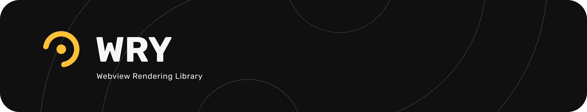

[](https://crates.io/crates/wry) [](https://docs.rs/wry/)
[](https://opencollective.com/tauri)
[](https://discord.gg/SpmNs4S)
[](https://tauri.app)
[](https://good-labs.github.io/greater-good-affirmation)
[](https://opencollective.com/tauri)

Cross-platform WebView rendering library in Rust that supports all major desktop platforms like Windows, macOS, and Linux.

<div align="center">
  <a href="https://gfycat.com/needywetelk">
    
  </a>
</div>

## Overview

WRY connects the web engine on each platform and provides easy to use and unified interface to render WebView.
The webview requires a running event loop and a window type that implements `HasWindowHandle`,
or a gtk container widget if you need to support X11 and Wayland.
You can use a windowing library like `tao` or `winit`.

## Usage

The minimum example to create a Window and browse a website looks like following:

```rust
fn main() -> wry::Result<()> {
  use tao::{
    event::{Event, StartCause, WindowEvent},
    event_loop::{ControlFlow, EventLoop},
    window::WindowBuilder,
  };
  use wry::WebViewBuilder;

  let event_loop = EventLoop::new();
  let window = WindowBuilder::new()
    .with_title("Hello World")
    .build(&event_loop)
    .unwrap();
  let _webview = WebViewBuilder::new(&window)
    .with_url("https://tauri.app")
    .build()?;

  event_loop.run(move |event, _, control_flow| {
    *control_flow = ControlFlow::Wait;

    match event {
      Event::NewEvents(StartCause::Init) => println!("Wry has started!"),
      Event::WindowEvent {
        event: WindowEvent::CloseRequested,
        ..
      } => *control_flow = ControlFlow::Exit,
      _ => (),
    }
  });
}
```

There are also more samples under `examples`, you can enter commands like the following to try them:

```
cargo run --example multiwindow
```

For more information, please read the documentation below.

## [Documentation](https://docs.rs/wry)

## Platform-specific notes

Here is the underlying web engine each platform uses, and some dependencies you might need to install.

### Linux

Wry also needs [WebKitGTK](https://webkitgtk.org/) for WebView. So please make sure the following packages are installed:

#### Arch Linux / Manjaro:

```bash
sudo pacman -S webkit2gtk-4.1
```

The `libayatana-indicator` package can be installed from the Arch User Repository (AUR).

#### Debian / Ubuntu:

```bash
sudo apt install libwebkit2gtk-4.1-dev
```

#### Fedora

```bash
sudo dnf install gtk3-devel webkit2gtk4.1-devel
```

Fedora does not have the Ayatana package yet, so you need to use the GTK one, see the [feature flags documentation](https://docs.rs/wry/latest/wry/#feature-flags).

### macOS

WebKit is native on macOS so everything should be fine.

If you are cross-compiling for macOS using [osxcross](https://github.com/tpoechtrager/osxcross) and encounter a runtime panic like `Class with name WKWebViewConfiguration could not be found` it's possible that `WebKit.framework` has not been linked correctly, to fix this set the `RUSTFLAGS` environment variable:

```
RUSTFLAGS="-l framework=WebKit" cargo build --target=x86_64-apple-darwin --release
```

### Windows

WebView2 provided by Microsoft Edge Chromium is used. So wry supports Windows 7, 8, 10 and 11.

### Android / iOS

Wry supports mobile with the help of [`cargo-mobile2`](https://github.com/tauri-apps/cargo-mobile2) CLI to create template project. If you are interested in playing or hacking it, please follow [MOBILE.md](MOBILE.md).

If you wish to create Android project yourself, there is a few requirements that your application needs to uphold:

1.  You need to set a few environment variables that will be used to generate the necessary kotlin
    files that you need to include in your Android application for wry to function properly:

    - `WRY_ANDROID_PACKAGE`: which is the reversed domain name of your android project and the app name in snake_case, for example, `com.wry.example.wry_app`
    - `WRY_ANDROID_LIBRARY`: for example, if your cargo project has a lib name `wry_app`, it will generate `libwry_app.so` so you se this env var to `wry_app`
    - `WRY_ANDROID_KOTLIN_FILES_OUT_DIR`: for example, `path/to/app/src/main/kotlin/com/wry/example`

2.  Your main Android Activity needs to inherit `AppCompatActivity`, preferably it should use the generated `WryActivity` or inherit it.
3.  Your Rust app needs to call `wry::android_setup` function to setup the necessary logic to be able to create webviews later on.
4.  Your Rust app needs to call `wry::android_binding!` macro to setup the JNI functions that will be called by `WryActivity` and various other places.

It is recommended to use [`tao`](https://docs.rs/tao/latest/tao/) crate as it provides maximum compatibility with `wry`

```rs
#[cfg(target_os = "android")]
{
  tao::android_binding!(
      com_example,
      wry_app,
      WryActivity,
      wry::android_setup, // pass the wry::android_setup function to tao which will invoke when the event loop is created
      _start_app
  );
  wry::android_binding!(com_example, ttt);
}
```

- `WRY_ANDROID_PACKAGE` which is the reversed domain name of your android project and the app name in snake_case for example: `com.wry.example.wry_app`
- `WRY_ANDROID_LIBRARY` for example: if your cargo project has a lib name `wry_app`, it will generate `libwry_app.so` so you set this env var to `wry_app`
- `WRY_ANDROID_KOTLIN_FILES_OUT_DIR` for example: `path/to/app/src/main/kotlin/com/wry/example`

## Partners

<table>
  <tbody>
    <tr>
      <td align="center" valign="middle">
        <a href="https://crabnebula.dev" target="_blank">
          
        </a>
      </td>
    </tr>
  </tbody>
</table>

For the complete list of sponsors please visit our [website](https://tauri.app#sponsors) and [Open Collective](https://opencollective.com/tauri).

## License

Apache-2.0/MIT
