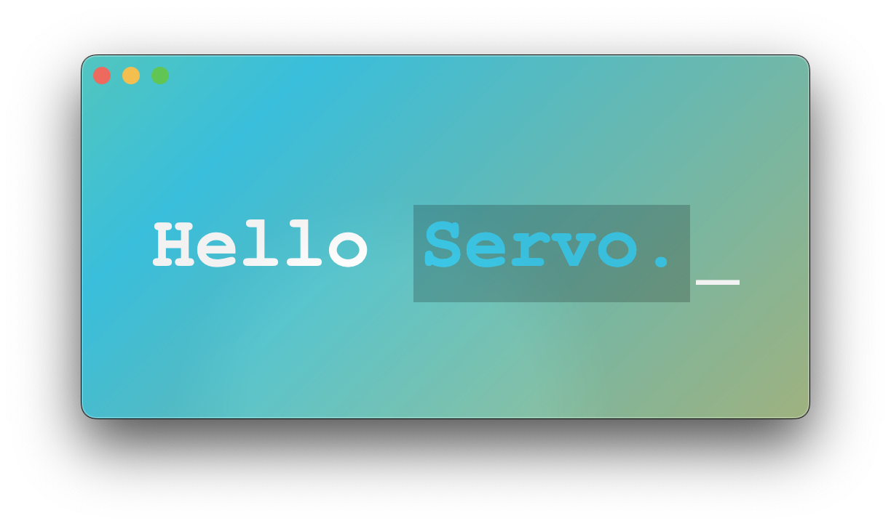

[](https://crates.io/crates/wry) [](https://docs.rs/wry/)
[](https://opencollective.com/tauri)
[](https://discord.gg/SpmNs4S)
[](https://tauri.app)
[](https://good-labs.github.io/greater-good-affirmation)
[](https://opencollective.com/tauri)

## Overview

This is the special branch of wry to experiment Servo, a web engine written mostly in Rust, as a crate dependency.
The motivation of this experiment is evaluating custom web egines that can be fully under our control and be customized at will.
And at the same time, finding the root cause and pivot point that could really improve and help web and rust community moving forward.
Servo fits into this position pretty well because it isn't controlled by any huge corporation. Evryone from the open source community is free to shape the project together.
While it doesn't provide full coverage of all web features yet, it already offers super flexible interface to work with.
In this branch, we showcase how to integrate and customize it to become a modern style landing page.


[Video link](https://twitter.com/Yu_Wei_Wu/status/1740251457285431487) to see the demo showcase

## Usage

The current demo works best on macOS at the moment, since it tries to customize its traffic light buttons to be seamless in the window.

It should also work on Windows, as well as Linux with X11. You may encounter problems running the demo on Linux with Wayland or Xwayland.

### Build

- Please follow the instructions in [Servo - Build Setup (macOS)](https://github.com/servo/servo#macos) to build a successful copy first.

- Download [mozjs binary](https://github.com/wusyong/mozjs/releases/tag/tag-8410b587d66a36f1660cc3b828359e199eb0760a) and set the environment variable:

```sh
MOZJS_MIRROR=path/to/libmozjs.tar.gz
```

- Build wry

  - Clone wry repository

  ```sh
  git clone https://github.com/tauri-apps/wry.git
  cd wry
  ```

  - **NixOS only:** add `wayland` and `libGL` to `LD_LIBRARY_PATH` in `../servo/etc/shell.nix`

  - Run servo example

  ```sh
  cargo run --example servo
  ```

    - Or if you are using Nix or NixOS:

    ```
    nix-shell ../servo/etc/shell.nix --run 'cargo run --example servo'
    ```

## Future Work

- Add more window and servo features to make it feel more like a general webview library.
- Improve Servo's development experience.
- Multi webviews and multi browsing contexts in the same window.